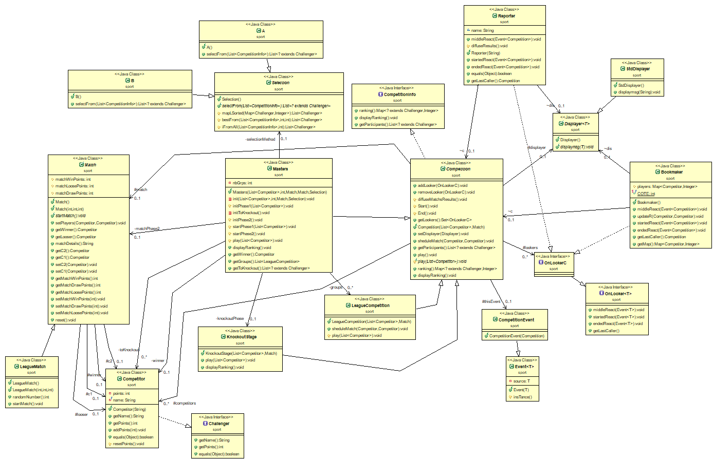

# Projet COO
 Aboelnaga Ahmed

# Compilation

Pour la compilation des classes sources  et en supposant l'existance du dossier classes utiliser la commande ci-dessous en vous plaçant dans le dossier racine du projet (en respectant l'ordre ):

`$ mkdir classes`

`$ javac -d "classes" src/util/*.java`

`$ javac -d "classes" -cp classes src/sport/*.java`

## Exécution

Pour l'exécution du main en vous plaçant dans le dossier classes:

`$ java sport.main`

## Compilation et exécution des tests

Pour la compilation des classes tests et en supposant l'existance du dossier classes contenant les fichiers compilés des classes sources  utiliser la commande ci-dessous en vous plaçant dans le dossier racine du projet:

`$ javac -d "classes" -cp classes:test-1.7.jar test/sport/*.java`

Pour l'exécution des tests. Utiliser cette commande en étant toujours dans le dossier racine du projet :

`$ java -jar test-1.7.jar sport.<fichier test>`

    where <fichier test> = LeagueMatchTest, LeagueCompetitionTest, CompetitorTest, KnockoutStageTest

# Doc

Dans le  dossier racine l'exécution de la commande qui suit permet la génération de la documentation du paquetage sport  :

`$ javadoc -d "doc"  src/sport/*`

(où L'option -d docs permet dans placer les fichiers générés dans un dossier docs)

# Création archive exécutable

Pour créer un fichier sport.jar par qui contient, compressés, tous les fichiers de l'arborescence dont la racine est le dossier example dans notre exemple. Utiliser cette commande en vous plaçant dans la dossier classes . Qui va créer ce fichier .jar dans la dossier racine du projet :

`$ jar cvf ../sport.jar sport util`

Pour visualiser le contenu de l'archive appli.jar créé dans notre exemple ci-dessus. Utiliser cette commande dans la dossier racine du projet:

`$ jar tvf sport.jar`

Pour permettre l'exécution d'un .jar donc de permettre la définition d'un main à exécuter. Il faut créer un fichier manifest (dans notre exemple manifest-ex). Contenant les informations nécessaire pour permettre l'exécution d'une fonction main d'une classe à l'exécution de notre archive .jar, dans notre exemple la main de sport:

`$ Main-Class: sport.main`

Placez vous dans le dossier classes, exécutez la commande :

`$ jar cvfm ../sport.jar ../manifest-ex sport util`

Vous avez créé la même archive que précédemment mais en y ajoutant les informations contenues dans le fichier manifest-ex. Ces informations sont stockées dans le fichier META-INF/MANIFEST.MF de l’archive.

Allez dans le dossier racine et exécutez la commande :

`$ java -jar sport.jar`

Le manifeste de l’archive est automatiquement utilisé pour déterminer le main à exécuter. Le CLASSPATH utilisé intègre automatiquement les fichiers de l’archive, il est donc inutile de préciser quoi que ce soit ici. Et la fonction main du fichier main.java est bien exécutée.

# Diagramme UML

# MakeFile
Vous pouvez utiliser une version simplifié du MakeFile crée il vous suffit d'exécuter la commande suivante depuis le dossier racine du projet :

`$ make`

Pour la création du .jar restez dans le dossier racine et exécutez la commande :

`$ make jar`

Pour exécuter le jar exécutez :

`$ make run`

Pour les tests et leur exécution voir section Compilation et exécution des tests
